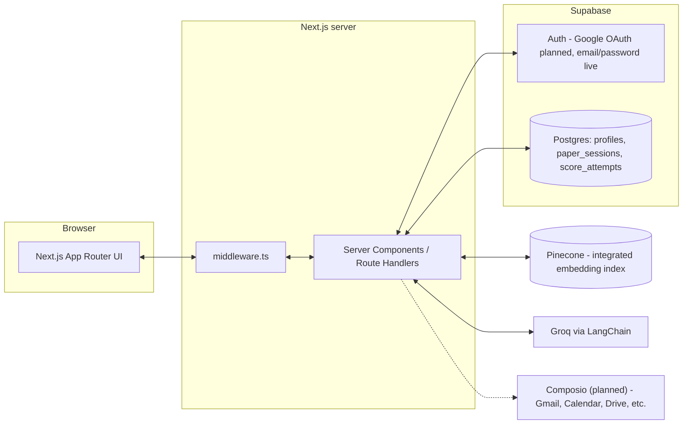
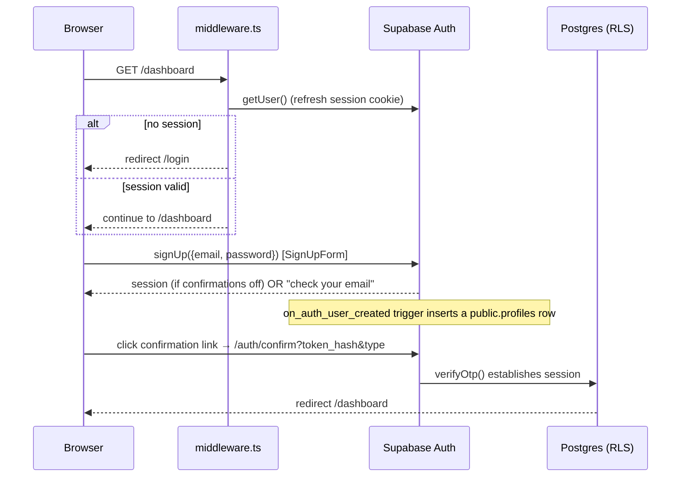

# Architecture

Technical overview of how ScholarPath is built. See [README.md](README.md) for the product pitch and setup steps, and [CLAUDE.md](CLAUDE.md) / [AGENTS.md](AGENTS.md) for AI-agent working notes.

## System overview



Everything that touches a secret (`GROQ_API_KEY`, `PINECONE_API_KEY`, `SUPABASE_SERVICE_ROLE_KEY`) runs server-side only — Server Components, Server Actions, or Route Handlers. The browser only ever sees `NEXT_PUBLIC_*` values.

## Directory structure

```
app/
  page.tsx                 Landing page (Server Component) — reads auth state, renders marketing sections
  login/page.tsx           Email/password sign-in
  signup/page.tsx          Email/password sign-up
  auth/callback/route.ts   Google OAuth code exchange (route not yet reachable — Google sign-in is disabled)
  auth/confirm/route.ts    Email confirmation link handler (supabase.auth.verifyOtp)
  dashboard/page.tsx       Protected shell — redirects to /login if unauthenticated
  layout.tsx               Root layout: font, dark mode, metadata
  globals.css              Tailwind + CSS variable theme (see Design system below)

components/
  ui/                      Design-system primitives (Button, Card, Badge, Input, Label) — shadcn-style,
                            ported to Tailwind v3 (see Design system)
  marketing/                Landing-page sections (Hero, Problem, HowItWorks, Pricing, Faq, etc.)
  auth/                     AuthProvider (client context), SignInForm, SignUpForm, GoogleSignInButton
                            (disabled — coming soon), SignOutButton

lib/
  env.ts                   Server-side env validation + client-safe Supabase config
  utils.ts                 cn() className helper (clsx + tailwind-merge)
  supabase/
    client.ts               Browser Supabase client (Client Components)
    server.ts                Server Supabase client (Server Components/Actions/Route Handlers)
    admin.ts                 Service-role client — bypasses RLS, server-only
  llm/client.ts             LangChain ChatGroq factory — the only place ChatGroq should be instantiated
  uniqueness/               Scoring engine — not yet implemented (Phase 3 in the README's "What's next")
  conferences/              Venue matching — not yet implemented

middleware.ts               Refreshes the Supabase session cookie every request; redirects unauthenticated
                             requests to /dashboard/* back to /login

supabase/migrations/        Postgres schema + RLS (001_init.sql)

scripts/
  create-pinecone-index.ts  Creates the integrated-embedding Pinecone index (llama-text-embed-v2, 1024-dim)
  ingest.ts                 Corpus ingestion — not yet implemented (Phase 2)

UI-Reference/                A separate, gitignored Next.js project used only as a visual/structural design
                              reference (its own copy of package.json, components, etc.) — not part of the
                              ScholarPath app and never imported from it.
```

## Rendering model

Every route that touches auth state is a **dynamic** Server Component (Next.js opts out of static generation automatically once a route calls `cookies()`, which `lib/supabase/server.ts` does under the hood):

| Route | Type | Behavior |
|---|---|---|
| `/` | Server Component | Reads `auth.getUser()`; Hero/Nav CTA and footer links adapt to signed-in state |
| `/login`, `/signup` | Server Component + Client form | Redirects to `/dashboard` if already signed in; the form itself (`SignInForm`/`SignUpForm`) is a Client Component calling `lib/supabase/client.ts` directly |
| `/dashboard` | Server Component | Redirects to `/login` if unauthenticated; wraps children in `AuthProvider` for future client-side auth state needs |
| `/auth/callback`, `/auth/confirm` | Route Handlers | No UI — exchange a code/token for a session, then redirect |
| `middleware.ts` | Edge middleware | Runs before every non-static request; keeps the session cookie fresh and gates `/dashboard/*` |

Marketing sections under `components/marketing/` that need interactivity (mobile nav toggle, the auto-rotating "How it works" step list, the pricing billing toggle, the FAQ accordion) are Client Components; everything else in that directory is a plain Server Component for less client JS.

## Auth flow



Google sign-in is intentionally disabled (`GoogleSignInButton` renders a disabled "coming soon" button) — the `/auth/callback` route and the OAuth code path already exist in `lib/supabase/server.ts`/the button component, so re-enabling it later is just: enable the Google provider in Supabase, and swap the disabled button for the real `signInWithOAuth` call.

## Data model (Supabase Postgres)

Defined in `supabase/migrations/001_init.sql`:

- **`profiles`** — 1:1 with `auth.users`, auto-created by an `on_auth_user_created` trigger on signup.
- **`paper_sessions`** — one row per research idea a student is iterating on (`idea_text`, `uniqueness_score`, `status`).
- **`score_attempts`** — history of uniqueness-score attempts for a session (populated once the uniqueness engine ships).

All three tables have RLS enabled with `auth.uid() = user_id` (or `= id` for `profiles`) policies — a user can only ever see or write their own rows. There is no service-role bypass anywhere in application code except `lib/supabase/admin.ts`, which nothing currently calls.

## Vector search (Pinecone)

The index is created via `scripts/create-pinecone-index.ts` using **integrated inference** (`createIndexForModel`, model `llama-text-embed-v2`, 1024 dimensions, cosine metric, field map `text`) — Pinecone embeds text server-side, so there's no separate embedding step or provider to manage. Once `scripts/ingest.ts` is implemented (Phase 2), it will upsert `{ text: abstract, title, year, url, ... }` records directly; the eventual uniqueness-scoring server action will call Pinecone's search API with the raw idea text and let Pinecone embed the query too.

## LLM calls (Groq via LangChain)

`lib/llm/client.ts` exports `createChatModel()`, the single factory for a `ChatGroq` instance (model configurable via `GROQ_MODEL`, default `llama-3.3-70b-versatile`). Any future feature that needs an LLM call (uniqueness explanations, section coaching, readiness checklists) should go through this factory rather than instantiating `ChatGroq` directly, so model/temperature defaults stay centralized.

## Third-party tool integrations (Composio — planned)

Not yet implemented — no dependency installed, no code written. Composio is the planned integration layer for connecting ScholarPath to third-party tools (Gmail, Google Calendar, Google Drive, and others as new features need them), rather than each feature hand-rolling its own OAuth + API client. The first concrete use is **deadline reminders**: a scheduled check against tracked conference deadlines that sends a Gmail/Calendar notification through Composio instead of a bespoke email integration. Later features (e.g., importing a paper draft from Drive) would reuse the same integration layer rather than adding a new one-off API client per feature.

## Design system

`components/ui/` is a shadcn/ui-style primitive set (Button, Card, Badge, Input, Label) built the same way the ecosystem usually does — `class-variance-authority` for variants, `@radix-ui/react-slot` for `asChild` composition, `cn()` (clsx + tailwind-merge) for class merging — but targeting **Tailwind v3**, not v4. This matters because [`UI-Reference/`](UI-Reference) (the visual reference this design system was translated from) is a v4 + Next 16 + React 19 project; porting its components verbatim would have broken this app's pinned Next 14/React 18/Tailwind v3 stack. The component APIs are functionally identical — only the CSS variable plumbing (HSL values in `tailwind.config.ts` + `app/globals.css` instead of v4's `@theme inline`) and a couple of package versions differ.

Theme tokens (`--background`, `--card`, `--muted-foreground`, `--accent`, `--border`, etc.) live in `app/globals.css` as HSL CSS variables, mapped to Tailwind color utilities in `tailwind.config.ts`. Two deliberate brand choices carried over from `UI-Reference`'s style: `--radius: 0` (sharp corners everywhere) and a blur-in word-by-word text reveal on headings (`components/marketing/BlurText.tsx`, via `framer-motion`) — with its amber accent swapped for this app's existing blue (`--accent: 217 91% 60%`).

## Known placeholder content

The landing page's "Trusted by," testimonials, and pricing sections use fictional school names, student quotes, and prices — there are no real customers, testimonials, or billing integration yet (Stripe billing is the last item in the README's roadmap). These exist purely to match the reference design's visual density and should be replaced with real content (or removed) before this is shown to anyone outside the team.
