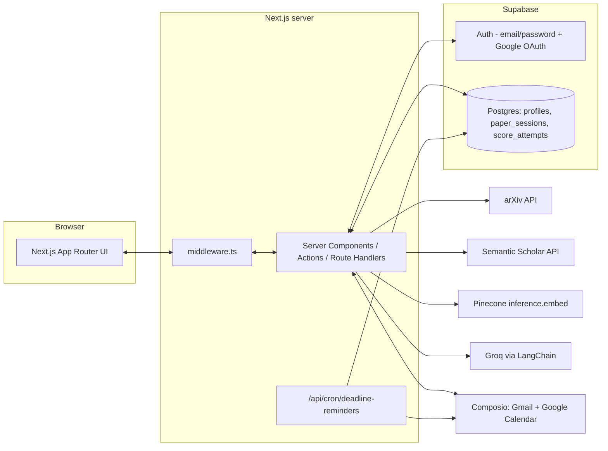
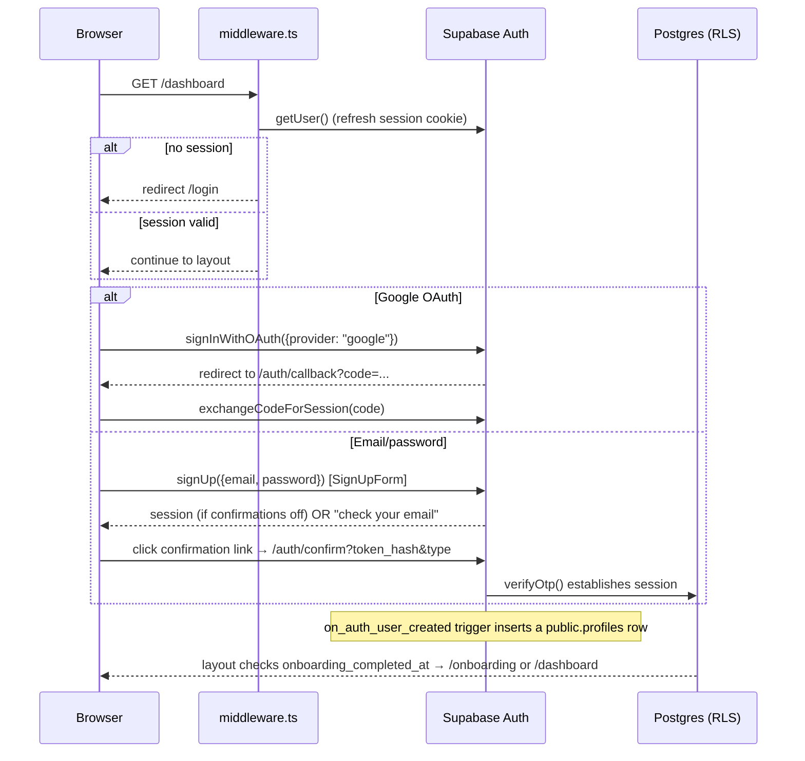

# Architecture

Technical overview of how ScholarPath is built. See [README.md](README.md) for the product pitch and setup steps, and [CLAUDE.md](CLAUDE.md) / [AGENTS.md](AGENTS.md) for AI-agent working notes.

## System overview



Everything that touches a secret (`GROQ_API_KEY`, `PINECONE_API_KEY`, `SUPABASE_SERVICE_ROLE_KEY`, `COMPOSIO_API_KEY`) runs server-side only — Server Components, Server Actions, or Route Handlers. The browser only ever sees `NEXT_PUBLIC_*` values.

## Directory structure

```
app/
  page.tsx                       Landing page (Server Component) — reads auth state, renders marketing sections
  login/page.tsx                 Email/password + Google sign-in
  signup/page.tsx                Email/password sign-up
  auth/callback/route.ts         Google OAuth code exchange → session, then redirect
  auth/confirm/route.ts          Email confirmation link handler (supabase.auth.verifyOtp)
  onboarding/
    page.tsx                     Server gate: redirects to /dashboard once onboarding_completed_at is set
    actions.ts                   completeOnboarding() — stamps profiles.onboarding_completed_at
  composio/callback/page.tsx     OAuth popup landing page; postMessage's the opener window, then closes
  api/cron/deadline-reminders/route.ts
                                 Daily cron (Bearer CRON_SECRET) — sends due Gmail reminders across all sessions
  dashboard/
    layout.tsx                  Auth gate + onboarding gate (redirects), AuthProvider, Sidebar
    page.tsx                    Overview — stats, score-trend chart, pipeline-completion tally,
                                 AI topic suggestions, upcoming deadlines
    actions.ts                  suggestTopics() server action
    uniqueness/                 Uniqueness scoring page + scoreIdea/loadSessionScoreHistory actions
    conferences/                Conference matching page + matchConferences/selectVenue actions
    outline/                    Outline builder page + generate/save actions
    coaching/                   Section coaching page + runSectionCoaching action
    readiness/                  Readiness check page + runReadinessCheck action
    deadlines/                  Deadline tracking page + schedule/acknowledge/send-now actions
    settings/                   Composio connect/disconnect page + actions (getIntegrationsStatus,
                                 startToolkitConnect, disconnectToolkitConnection)
  layout.tsx                    Root layout: font, dark mode, metadata
  globals.css                   Tailwind + CSS variable theme (see Design system below)

components/
  ui/                          Design-system primitives: Button, Card, Badge, Input, Label,
                                Textarea, Select (Radix), Checkbox (Radix)
  dashboard/
    Sidebar.tsx                  Persistent left nav — desktop fixed column, mobile slide-over drawer
    DashboardModuleShell.tsx     Shared per-module header (back link, title, description) + content wrapper
    SessionSelect.tsx            Reusable "paper session" Select dropdown, shared by 7 of 8 modules
    StatTile.tsx                 Label/value/hint stat card (Overview)
    ScoreTrendChart.tsx          Recharts area chart — score attempts over time, 40/70 reference lines
    PipelineProgress.tsx         Icon + count tally per completed pipeline stage (Overview)
    TopicSuggestions.tsx         AI-suggested research topics card, refreshable via suggestTopics action
    UpcomingDeadlines.tsx        Soonest venue deadlines list (Overview)
  onboarding/OnboardingFlow.tsx  2-step client wizard: product tour → connect Gmail/Calendar
  icons/AppLogos.tsx             GmailLogo / GoogleCalendarLogo — app-icon-tile style SVGs
  marketing/                    Landing-page sections (Hero, Problem, HowItWorks, Pricing, Faq, etc.)
  auth/                         AuthProvider, SignInForm, SignUpForm, GoogleSignInButton, SignOutButton
  settings/IntegrationsPanel.tsx Composio connect/disconnect UI — shared between Settings and onboarding
  uniqueness/, conferences/, outline/, coaching/, readiness/, deadlines/
                                Per-module client forms (idea textarea, venue cards, outline editor, …)

lib/
  env.ts                       Server-side env validation + client-safe Supabase config
  utils.ts                     cn() className helper (clsx + tailwind-merge)
  action-result.ts             Shared ActionResult<T> = {ok:true,data} | {ok:false,error} type
  sessions.ts                  requireUser() + paper_sessions list/load/update helpers
  scoreBucketStyles.ts         Shared green/yellow/red ScoreBucket → success/warning/danger class maps
  supabase/
    client.ts                   Browser Supabase client (Client Components)
    server.ts                   Server Supabase client (Server Components/Actions/Route Handlers)
    admin.ts                    Service-role client — bypasses RLS, server-only (cron job, backfills)
  llm/client.ts                LangChain ChatGroq factory — the only place ChatGroq should be instantiated
  uniqueness/                  Live literature search + standalone embed + score + explain
  conferences/
    venues.ts                   Seeded list of 12 real venues (tier, field, deadline, requirements, …)
    match.ts                    Embedding-based topic-fit ranking + Groq primary/fallback path advice
    upcoming.ts                 Pure helper: soonest-deadline venues for the Overview page
  outline/generate.ts          Groq-backed venue-specific outline generation
  coaching/coach.ts             Groq-backed section critique + live citation search
  readiness/assess.ts           Groq-backed checklist scoring against venue requirements
  deadlines/
    milestones.ts                In-app countdown milestone computation
    reminders.ts                 Composio-backed Gmail/Calendar reminder scheduling + sending
  composio/
    client.ts                    Composio SDK client factory + isComposioConfigured()
    connections.ts               createConnectLink / getToolkitConnectionStatuses / disconnectToolkit
  dashboard/
    stats.ts                     getDashboardStats() — session counts, score trend, completed-actions tally
    topicSuggestions.ts          getSuggestedTopics() — Groq call with a static FALLBACK_TOPICS degrade path

middleware.ts                  Refreshes the Supabase session cookie every request; redirects unauthenticated
                                requests to /dashboard/* or /onboarding/* back to /login

supabase/migrations/           Postgres schema + RLS (001_init, 002_pipeline, 003_onboarding)

scripts/
  create-pinecone-index.ts     Optional integrated-embedding Pinecone index (unused by uniqueness scoring)
  ingest.ts                    Optional corpus ingestion — not used by the live-search uniqueness path
  test-composio-reminders.ts   CLI smoke test for the Composio Gmail/Calendar reminder flow

UI-Reference/                  A separate, gitignored Next.js project used only as a visual/structural design
                                reference — not part of the ScholarPath app and never imported from it.
```

## Rendering model

Every route that touches auth state is a **dynamic** Server Component (Next.js opts out of static generation automatically once a route calls `cookies()`, which `lib/supabase/server.ts` does under the hood):

| Route | Type | Behavior |
|---|---|---|
| `/` | Server Component | Reads `auth.getUser()`; Hero/Nav CTA and footer links adapt to signed-in state |
| `/login`, `/signup` | Server Component + Client form | Redirects to `/dashboard` if already signed in; the form itself (`SignInForm`/`SignUpForm`/`GoogleSignInButton`) is a Client Component calling `lib/supabase/client.ts` directly |
| `/onboarding` | Server Component + Client wizard | Redirects to `/dashboard` once `profiles.onboarding_completed_at` is set; otherwise renders `OnboardingFlow` |
| `/dashboard` (layout) | Server Component | Redirects to `/login` if unauthenticated, to `/onboarding` if onboarding isn't complete (fails open if the migration hasn't run yet); renders `Sidebar` + `AuthProvider` |
| `/dashboard` (page) | Server Component | Overview: stats, score trend, pipeline progress, topic suggestions, upcoming deadlines |
| `/dashboard/uniqueness|conferences|outline|coaching|readiness|deadlines|settings` | Server Component + Client form | Auth-gated module UI; each has its own server actions file |
| `/auth/callback`, `/auth/confirm` | Route Handlers | No UI — exchange a code/token for a session, then redirect |
| `/composio/callback` | Client page | OAuth popup landing page; `postMessage`s the opener and closes, or redirects to Settings if opened directly |
| `/api/cron/deadline-reminders` | Route Handler | `Authorization: Bearer $CRON_SECRET`-gated; no UI |
| `middleware.ts` | Edge middleware | Runs before every non-static request; keeps the session cookie fresh and gates `/dashboard/*` + `/onboarding/*` |

Marketing sections under `components/marketing/` that need interactivity (mobile nav toggle, the auto-rotating "How it works" step list, the pricing billing toggle, the FAQ accordion) are Client Components; everything else in that directory is a plain Server Component for less client JS.

## Auth flow



## Data model (Supabase Postgres)

Defined across `supabase/migrations/001_init.sql`, `002_pipeline.sql`, and `003_onboarding.sql`:

- **`profiles`** — 1:1 with `auth.users`, auto-created by an `on_auth_user_created` trigger on signup. Columns: `id`, `email`, `display_name`, `created_at`, `onboarding_completed_at`.
- **`paper_sessions`** — one row per research idea a student is iterating on: `idea_text`, `uniqueness_score`, `status`, plus JSONB `selected_venue`, `outline`, `section_feedback`, `readiness`, `deadline_tracking` written independently by each pipeline stage's server action.
- **`score_attempts`** — history of uniqueness-score attempts for a session (`score`, `explanation` JSONB, `created_at`) — the source for the Overview page's score-trend chart.

All three tables have RLS enabled with `auth.uid() = user_id` (or `= id` for `profiles`) policies — a user can only ever see or write their own rows. The only service-role bypass in application code is `lib/supabase/admin.ts`, used by the deadline-reminders cron route (it needs to read across all users' sessions) and available for one-off operational backfills.

**Fail-open pattern:** `app/dashboard/layout.tsx` treats a missing/errored `onboarding_completed_at` read as "onboarding complete" rather than blocking access — so deploying the app code ahead of running `003_onboarding.sql` never locks existing users out.

## Pipeline stages (dashboard)

After uniqueness scoring, sessions carry forward through:

| Route | Role |
|---|---|
| `/dashboard/conferences` | Embed idea vs seeded venues (`lib/conferences/venues.ts`); Groq primary/fallback path; save `selected_venue` |
| `/dashboard/outline` | Venue-specific outline via Groq → `outline` |
| `/dashboard/coaching` | Section critique + live citation candidates → append `section_feedback` |
| `/dashboard/readiness` | Venue checklist + readiness score → `readiness` |
| `/dashboard/deadlines` | In-app countdown milestones + Composio Gmail/Calendar reminders → `deadline_tracking` |

The Overview page's **Pipeline progress** tally (`components/dashboard/PipelineProgress.tsx`) counts sessions with each of these JSONB columns populated — independent yes/no counts per stage, not a single mutually-exclusive "current status," so a session can count toward multiple stages at once.

## Uniqueness scoring (live search + standalone embed)

Pipeline: idea text → search arXiv + Semantic Scholar in parallel → batch-embed idea + candidates via `pc.inference.embed()` (`llama-text-embed-v2`, `inputType: "passage"`) → cosine similarity + `score = 100 − avg(top-5) × 100` in app code → Groq structured explanation → persist `paper_sessions` / `score_attempts`.

- Search and scoring live under `lib/uniqueness/` (`search.ts`, `embed.ts`, `score.ts`, `explain.ts`).
- The server action is `app/dashboard/uniqueness/actions.ts` (`scoreIdea`) — returns `{ ok, data } | { ok, error }`, never throws for expected failures.
- Empty search results yield score `100` with `corpusEmpty: true` and a cautious canned explanation (no Groq call).
- Groq failures degrade the explanation only (`explanationDegraded: true`); the numeric score still returns.
- Optional `SEMANTIC_SCHOLAR_API_KEY` via `env.semanticScholarApiKey` — keyless works; a free key improves rate limits.
- The Overview page's "Score this idea" links from `TopicSuggestions` pass an `?idea=` query param that `app/dashboard/uniqueness/page.tsx` uses to prefill `UniquenessForm` with a fresh (session-less) idea.

## Vector search (Pinecone) — optional index path

`scripts/create-pinecone-index.ts` and `scripts/ingest.ts` still exist for an optional future corpus/index workflow, but **uniqueness scoring does not use them**. Standalone `inference.embed()` only needs `PINECONE_API_KEY`.

## LLM calls (Groq via LangChain)

`lib/llm/client.ts` exports `createChatModel()`, the single factory for a `ChatGroq` instance (model configurable via `GROQ_MODEL`, default `llama-3.3-70b-versatile`). Every LLM call in the app goes through this factory and follows the same shape: `createChatModel({temperature}).withStructuredOutput(zodSchema, {name})`, invoked with a system + user message, parsed with the same zod schema, and wrapped in a `try/catch` that returns a hand-written fallback with a `degraded: true` flag on failure (never throws to the caller). Current call sites:

- `lib/uniqueness/explain.ts` — overlap/novelty explanation
- `lib/conferences/match.ts` — primary/fallback venue advice
- `lib/outline/generate.ts` — venue-specific outline
- `lib/coaching/coach.ts` — section critique
- `lib/readiness/assess.ts` — readiness checklist
- `lib/dashboard/topicSuggestions.ts` — Overview "topics worth trying" (only invoked on demand via the `suggestTopics` action, not on every page load, to keep Overview fast)

## Third-party tool integrations (Composio)

`lib/composio/client.ts` wraps the `@composio/core` SDK behind `getComposio()` / `isComposioConfigured()`. Each student connects their **own** Gmail and Google Calendar — there's no shared/app-level connection:

1. **Settings** (or the second onboarding screen) renders `IntegrationsPanel`, which calls `getIntegrationsStatus()` to list connection state per toolkit (`gmail`, `googlecalendar`).
2. Clicking Connect calls `startToolkitConnect()` (`app/dashboard/settings/actions.ts`), which calls `createConnectLink()` (`lib/composio/connections.ts`) — this auto-creates a managed Composio Auth Config on first use (no manual per-toolkit setup required) and returns an OAuth redirect URL.
3. That URL opens in a popup pointed at `/composio/callback`; on completion the popup `postMessage`s the opener window and closes, and `IntegrationsPanel` refreshes its status.
4. **Deadline reminders** (`lib/deadlines/reminders.ts`) send through the connected Gmail account from `/dashboard/deadlines` (on-demand "send due reminders now") and from the daily `/api/cron/deadline-reminders` route (`Authorization: Bearer $CRON_SECRET`-gated, uses the service-role client to scan all users' sessions with a `selected_venue`).

`scripts/test-composio-reminders.ts` (`npm run test:composio`) is a CLI smoke test against a real or override Composio user id (`COMPOSIO_USER_ID`).

## Dashboard UI (sidebar, onboarding, Overview)

- **Sidebar** (`components/dashboard/Sidebar.tsx`) replaced an earlier top-nav bar: a persistent left column on desktop (`lg:sticky`, transparent background, thin `border-r`), collapsing to a full-screen slide-over drawer on mobile (hamburger toggle, closes on route change). Nav items highlight with the accent color when active; the signed-in email + sign-out button live in a footer section.
- **Onboarding** (`app/onboarding/`, `components/onboarding/OnboardingFlow.tsx`) is a 2-step client wizard shown once per account, gated by `profiles.onboarding_completed_at`: step 1 is a product tour (the six pipeline stages); step 2 reuses `IntegrationsPanel` to offer connecting Gmail/Calendar, with "Skip for now" and "Finish setup" both marking onboarding complete via the `completeOnboarding` server action.
- **Overview** (`app/dashboard/page.tsx`) composes `getDashboardStats()` (session/score counts + a 30-attempt score trend + a per-stage completed-actions tally, all queried from Supabase) with `getUpcomingDeadlines()` (a pure function over the static `VENUES` list, no I/O) and `getSuggestedTopics()` (Groq-backed, called on demand via a button rather than on every page load — see LLM calls above). An empty state (no sessions yet) shows a single "Score your first idea" CTA instead of empty charts.

## Design system

`components/ui/` is a shadcn/ui-style primitive set (`Button`, `Card`, `Badge`, `Input`, `Label`, `Textarea`, `Select`, `Checkbox`) built the same way the ecosystem usually does — `class-variance-authority` for variants, `@radix-ui/react-slot`/`react-select`/`react-checkbox` for accessible composed primitives, `cn()` (clsx + tailwind-merge) for class merging — but targeting **Tailwind v3**, not v4. This matters because [`UI-Reference/`](UI-Reference) (the visual reference this design system was originally translated from) is a v4 + Next 16 + React 19 project; porting its components verbatim would have broken this app's pinned Next 14/React 18/Tailwind v3 stack. The component APIs are functionally identical — only the CSS variable plumbing (HSL values in `tailwind.config.ts` + `app/globals.css` instead of v4's `@theme inline`) and a couple of package versions differ.

Theme tokens (`--background`, `--card`, `--muted-foreground`, `--accent`, `--border`, `--success`, `--warning`, `--danger`, etc.) live in `app/globals.css` as HSL CSS variables, mapped to Tailwind color utilities in `tailwind.config.ts`. `--success`/`--warning`/`--danger` (green/amber/red) back every status indicator across the app — uniqueness score buckets, readiness checklist items, connection status badges, error/success messages — instead of each component hardcoding its own `red-400`/`green-500`/etc. Tailwind class. Two deliberate brand choices carried over from `UI-Reference`'s style: `--radius: 0` (sharp corners everywhere) and a blur-in word-by-word text reveal on headings (`components/marketing/BlurText.tsx`, via `framer-motion`) — with its amber accent swapped for this app's existing blue (`--accent: 217 91% 60%`).

Charts (`components/dashboard/ScoreTrendChart.tsx`) use **recharts**, themed against the same HSL tokens (accent blue for the line/area, muted gray for axes/gridlines, success/warning-tinted reference lines at the 70/40 score thresholds) rather than recharts' default palette.

`lib/scoreBucketStyles.ts` centralizes the `ScoreBucket` ("green"|"yellow"|"red") → Tailwind class maps (`SCORE_BUCKET_TEXT`, `SCORE_BUCKET_BADGE`) so every module that renders a score badge uses the same mapping instead of redefining its own.

## Known placeholder content

The landing page's "Trusted by," testimonials, and pricing sections use fictional school names, student quotes, and prices — there are no real customers, testimonials, or billing integration yet (Stripe billing is the last item in the README's roadmap). These exist purely to match the reference design's visual density and should be replaced with real content (or removed) before this is shown to anyone outside the team.
